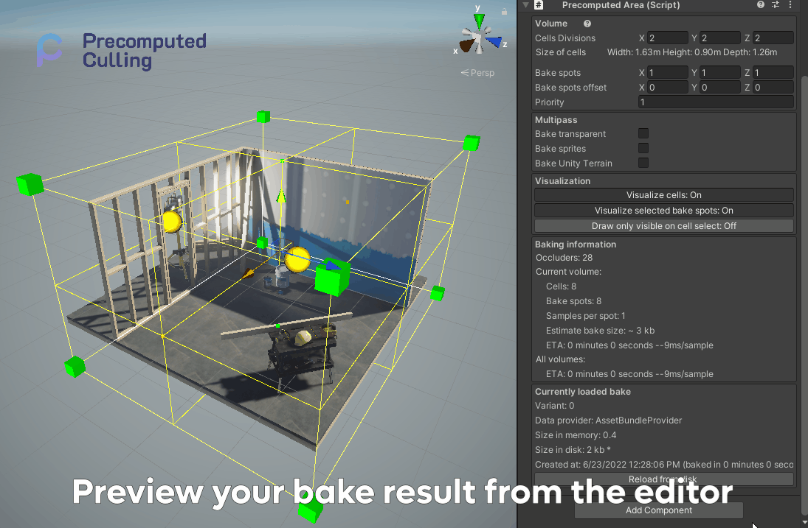
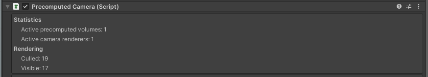
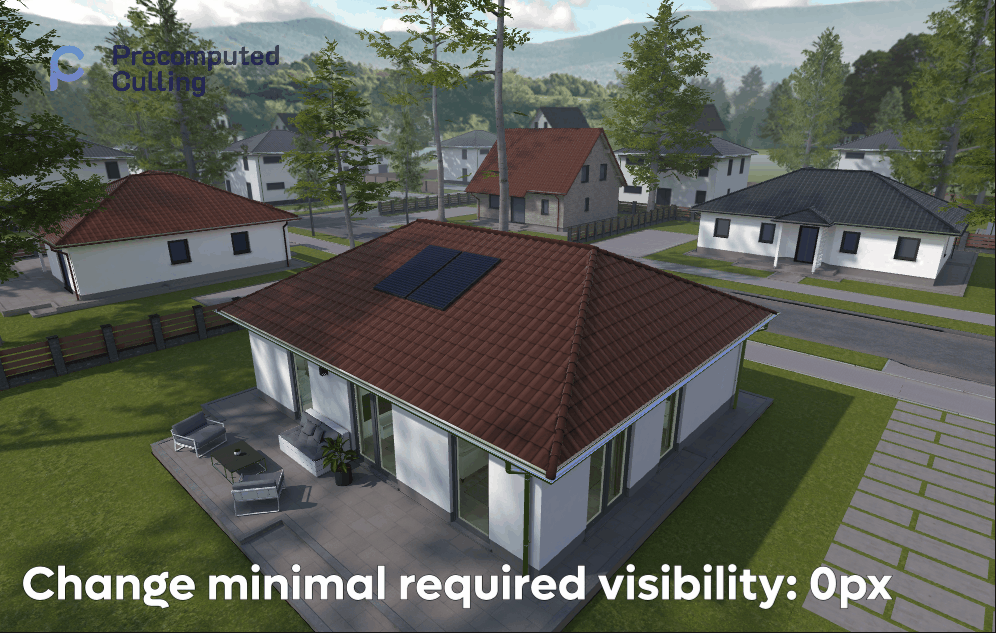
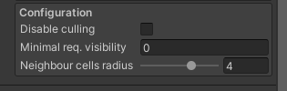

# Features of [Precomputed Culling](https://prographers.com/precomputed-culling) by Prographers

## Gizmos and Handles

Use built in Gizmos and Handles to manipulate the culling volume. Adjust area to your needs with clear visual feedback. 

Using visual feedback see how your changes affect the culling cells. What are the areas that would contain culling data, as well as the bakes spots that would be used to generate the final image.

Adjust them using the inspector.

Adjust the priority of the cell, to determine which data should be used to generate the final image.

## Preview your culling results

Preview your culling results in the scene view. Click on the area that you want to preview, and enable the preview mode.

*Note: Remember to bake the culling data before previewing!*

## Detailed information for runtime debugging

Each of the components have detailed information for runtime debugging. Information like currently rendered elements, culled elements, total bake spots and total cells. 

Each of the bake also contains data about it's preview bake time and it's size in the disk as well as the size in the memory.

**Data in the Precomputed Area**

**Data in the Precomputed Camera**

## Configure the culling precision and quality

### Minimal required visibility

Configure the culling precision and quality. Use Minimal required visibility to allow for small objects to be culled, even if in theory visible. 

The culling is based on 4096x4096 pixels of resolution per sample. So each sample is based on 16 million pixels. By default when we set 0 or 1 of visibility we will see all objects, even if they were only single pixel visible. The more we will increase this value, we will change how much of the object should be visible before it is culled.

*Note: This has impact on small objects, like single rocks or cutlery. Because they might generate a very little pixels on the samples, they will disappear faster then they should.*

*Note: At the time of writing this, you can only preview the visibility of the object in the runtime. This is subject to change in future versions.*

*Right click on a gif -> `Show controlls elements`, to slow down time to preview gif step by step*

### Neighbour cell radius

Determines how far the algorithm will look for neighboring cells. If it's set to 0, it will only take the cell we are currently in to generate the culling. If it's set to 1, it will take the cell we are currently in and it's neighbors. If it's set to 2, it will take the cell we are currently in and it's neighbors and it's neighbors, etc...

This is usefully if you have an open world and you want to make sure that there are no artifacts in the culling for objects that are behind small ocluders like trees. 

This setting will slightly decrease the performance because it will have to load data from not one but at least 4 cells.

