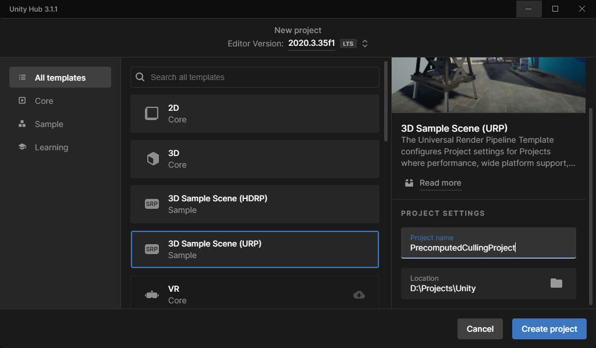

# Quick Start Guide

We will start by creating a new project, but you can also use your existing project.

## New Project

 1. In the Unity Hub, click on "Create New Project",
 2. Select "3D Sample Scene (URP)" and give it a name,
 3. Click Create project,

    *note: You can also use your existing project.*

## Install Precomputed Culling via Package Manager

 1. Open package manager, by pressing `Window > Package Manager`,
 2. In the top dropdown change Package to My Assets,
 3. Select `Precomputed Culling` and press Install,
 4. Done.

## Install Precomputed Culling via Unity Package

 1. Locate the `PrecomputedCullingProg.unitypackage` package in file explorer.
 2. Double click on the package,
 3. In the new opened window press `Import`
 4. Done.

## Setup Precomputed Culling

1. Open the main scene where you want to initialize your setup,
2. In the top menu, press Tools->Precomputed Culling->Setup,
   - Optional - Create new GameObject, and add `PrecomputedArea` component to it.
3. Adjust Precomputed Volume/Area to match the play area of your player (note you can have multiple areas),
4. Adjust cell density and camera control (Find the best setting between bake Quality and Bake time and performance).
5. Start baking either in Tools->Precomputed Culling->Bake or in Area
6. Wait for bake to finish
7. Enjoy an increase in performance

